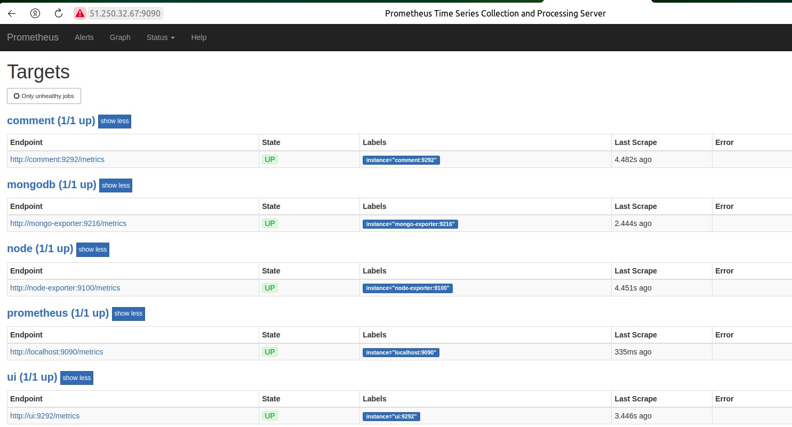
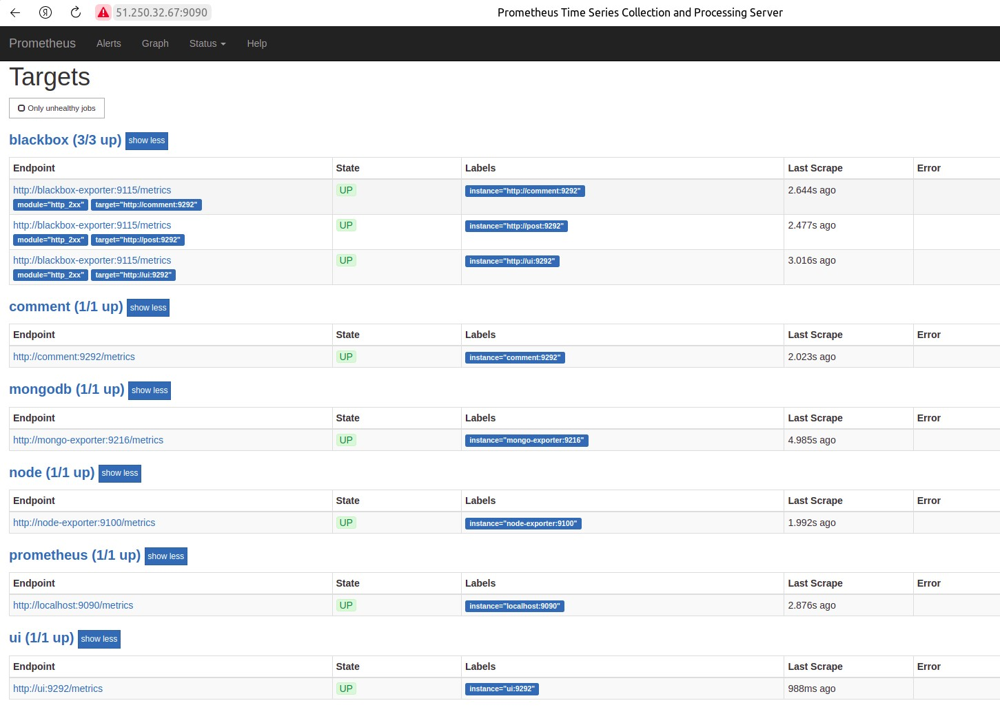

# skyfly535_microservices
skyfly535 microservices repository

# HW16 Введение в мониторинг. Системы мониторинга.

## В процессе выполнения ДЗ выполнены следующие мероприятия:

1. Создан Docker хост в Yandex Cloud;

```
yc compute instance create \
  --name docker-host \
  --zone ru-central1-c \
  --network-interface subnet-name=default-ru-central1-c,nat-ip-version=ipv4 \
  --create-boot-disk image-folder-id=standard-images,image-family=ubuntu-1804-lts,size=15 \
  --ssh-key ~/.ssh/id_rsa.pub
```

и инициализировано окружение Docker;

```
docker-machine create \
  --driver generic \
  --generic-ip-address=51.250.32.67 \
  --generic-ssh-user yc-user \
  --generic-ssh-key ~/.ssh/id_rsa  \
  docker-host

eval $(docker-machine env docker-host)
```

2. Запущен контейнер с системой мониторинга `Prometheus` из готовым образом с `DockerHub`;

```
$ docker run --rm -p 9090:9090 -d --name prometheus prom/prometheus
```

3. Изучены web интерфейс системы мониторинга, метрики по умолчанию;


4. Изучен раздел `Targets` (цели) и формат собираемых метрик, доступных по адресу `host:port/metrics`;

5. Создан `Dockerfile` ( ./monitoring/prometheus/Dockerfile) при помощи которого копируем файл конфигурации `prometheus.yml` с "нашей" машины внутрь контейнера;

6. Созданы образы микросервисов `ui`, `post-py` и `comment` при помощи скриптов `docker_build.sh`, которые есть в директории каждого сервиса соответственно для добавления информации из Git в наш `healthcheck`;

```
/src/ui $ bash docker_build.sh
/src/post-py $ bash docker_build.sh
/src/comment $ bash docker_build.sh
```
или сразу все из корня репозитория

```
for i in ui post-py comment; do cd src/$i; bash docker_build.sh; cd -; done
```
7. Создан файл `docker/docker-compose.yml` для совместного развертывания микросервисов `ui`, `post-py`, `comment` и системы мониторинга `Prometheus`;

8. Добавлен сервис `prom/node-exporter:v0.15.2` в `docker/docker-compose.yml` для сбора информации о работе Docker хоста (нашей ВМ) и представления этой информации в Prometheus;



### Ссылка на докер хаб с собранными образами

```
https://hub.docker.com/repositories/skyfly534
```
## Дополнительные задания

9. Добавлен сервис `percona/mongodb_exporter:0.40` в `docker/docker-compose.yml` для сбора информации о работе СУБД `MongoDB` и представления этой информации в Prometheus;

docker-compose.yml:

```
...

mongo-exporter:
    image: percona/mongodb_exporter:0.40
    command:
      - '--mongodb.uri=mongodb://post_db:27017'
      - '--collect-all'
      - '--log.level=debug'
    ports:
      - '9216:9216'
    networks:
      - back_net

...
```
prometheus.yml:

```
...

- job_name: 'mongodb'
    static_configs:
      - targets:
        - 'mongo-exporter:9216'

...
```
10. Добавлен мониторинг сервисов `comment`, `post`, `ui` в Prometheus с помощью `Blackbox exporter`;

monitoring/blackbox/Dockerfile:

```
FROM prom/blackbox-exporter:latest
ADD config.yml /etc/blackbox_exporter/
```

monitoring/blackbox/config.yml:

```
modules:
  http_2xx:
    prober: http
    timeout: 5s
    http:
      valid_http_versions: ["HTTP/1.1", "HTTP/2.0"]
      valid_status_codes: []
      method: GET
      follow_redirects: false
```
docker-compose.yml:

```
...

blackbox-exporter:
    image: ${USERNAMEDEVOPS}/blackbox-exporter
    networks:
      - front_net
    depends_on:
      - ui
      - post
      - comment

...
```
monitoring/prometheus/prometheus.yml:

```
- job_name: 'blackbox'
    metrics_path: /metrics
    params:
      module: [http_2xx]
    static_configs:
      - targets:
        - http://ui:9292
        - http://comment:9292
        - http://post:9292
    relabel_configs:
      - source_labels: [__address__]
        target_label: __param_target
      - source_labels: [__param_target]
        target_label: instance
      - target_label: __address__
        replacement: blackbox-exporter:9115

```
### Итоговый список endpoint-ов Prometheus



11. Написаны `Makefile` в каждом из каталогов `./src/ui/Makefilecd`, `./src/post-py/Makefilecd`, `./src/comment/Makefilecd` и `./src/Makefilecd` , которые "билдят" либо "пушат" каждые образ по отдельности, либо все сразу.

Для сборки отдельного образа выполняем `make` в соответствующем каталоге. Для "пуша" в `DockerHub` выполняем `make push`. Эти же команды в родительском каталоге будут действовать на все три сервиса.

# HW15 Устройство Gitlab CI. Построение процесса непрерывной поставки.

## В процессе выполнения ДЗ выполнены следующие мероприятия:

1. Подготовлен образ ВМ при помощи `packer` с минимальными для `Gitlab CI` требованиями;

 - 2 core СPU
 - 4 GB RAM
 - 50 GB HDD

Изначально созданный файл конфига образа `docker.json`, был преобразован средствами packer в формат `HCL`

```
packer hcl2_upgrade -with-annotations ./packer/docker.json
```
В результате был сформирован файл конфига `./gitlab-ci/packer/docker.json.pkr.hcl` и сформирован файл с переменными `./gitlab-ci/packer/yandex.pkrvars.hcl`.

Проверка шаблона и запуск сборки образа

```
packer validate -var-file=yandex.pkrvars.hcl docker.json.pkr.hcl

packer build -var-file=yandex.pkrvars.hcl docker.json.pkr.hcl
```

2. Запущена ВМ из образа `packer` при помощи `terraform`;

В кталоге `./gitlab-ci/terraform/` выполняем следующие команды:

```
terraform validate

terraform apply
```

3. При помощи ansible playbook `./gitlab-ci/ansible/gitlab_ci_in_docker.yml` развернут `Gitlab` в контейнере;

Используем плагин inventory для YC из предыдущих ДЗ.

Для работы с контейнерами используем модуль  `docker_container_module`.

```
$ ansible-playbook gitlab_ci_in_docker.yml

PLAY [Gitlab CI deployment in Docker] ****************************************************************************

TASK [Gathering Facts] *******************************************************************************************
ok: [51.250.85.59]

TASK [create dirs for data volumes] ******************************************************************************
changed: [51.250.85.59] => (item=/srv/gitlab/config)
changed: [51.250.85.59] => (item=/srv/gitlab/logs)
changed: [51.250.85.59] => (item=/srv/gitlab/data)

TASK [install PIP] ***********************************************************************************************
changed: [51.250.85.59]

TASK [install Docker] ********************************************************************************************
changed: [51.250.85.59]

TASK [Gitlab CI deployment in Docker] ****************************************************************************
changed: [51.250.85.59]

PLAY RECAP *******************************************************************************************************
51.250.85.59               : ok=5    changed=4    unreachable=0    failed=0    skipped=0    rescued=0    ignored=0
```
После запуска открываем браузер и идем на `http://51.250.85.59` (внешний IP ВМ).

Login для первого входа `root`. Что узнать пароль заходим на ВМ и выполняем следующую команду:

```
sudo docker exec -it gitlab grep 'Password:' /etc/gitlab/initial_root_password
```
где `gitlab` имя контейнера.

4. Через веб-интерфейс создана группа `homework`, в ней проект `example`. Склонирован репозиторий на локальную машину;

```
git clone http://51.250.85.59/homework/example.git
```
так же понадобятся аутентификационные данные описанные выше.

5. В корне репозитория создана начальная версия тестового пайплайна `./.gitlab-ci.yml` и запушина в репозиторий;

```
git add .gitlab-ci.yml

git commit -m "Add pipeline definition"

git push
```
В `CI/CD -> Pipelines` видим, что запушеный пайплайн застрял в состоянии `pending`. Необходимо установить раннеры, которые могут выполнять работу.

6. Установлен, запущен и зарегистрирован раннер (в контейнере);

```
sudo mkdir -p /srv/gitlab-runnner/config

docker run -d --name gitlab-runner --restart always -v /srv/gitlab-
runner/config:/etc/gitlab-runner -v /var/run/docker.sock:/var/run/docker.sock
gitlab/gitlab-runner:latest

docker exec -it gitlab-runner gitlab-runner register \
--url http://51.250.85.59/ \
--non-interactive \
--locked=false \
--name DockerRunner \
--executor docker \
--docker-image alpine:latest \
--registration-token GR13489417h3XsW7nxUeqx1U3MLnR \
--tag-list "linux,xenial,ubuntu,docker" \
--run-untagged
```
Пайплайн вышел из застрявшего состояния, отработал без ошибок.

7. Добавлено приложение `reddit` в проект;

```
git clone https://github.com/express42/reddit.git

Не забываем удалить каталог .git у склонированного иначе не запуши
rm -rf ./reddit/.git

git add reddit/

git commit -m "Add reddit app"

git push
```
8. Добавлен запуск тестов приложения `reddit` в пайплайн;

```
image: ruby:2.4.2
stages:
...

variables:
  DATABASE_URL: 'mongodb://mongo/user_posts'
before_script:
  - cd reddit
  - bundle install
...

test_unit_job:
  stage: test
  services:
    - mongo:latest
  script:
    - ruby simpletest.rb
...
```

Создан файл с тестом `reddit/simpletest.rb`

```
require_relative './app'
require 'test/unit'
require 'rack/test'

set :environment, :test

class MyAppTest < Test::Unit::TestCase
  include Rack::Test::Methods

  def app
    Sinatra::Application
  end

  def test_get_request
    get '/'
    assert last_response.ok?
  end
end
```

В `reddit/Gemfile` добавлена библиотека `rack-test` для тестирования

```
...
gem 'sinatra', '~> 2.0.1'
gem 'haml'
gem 'bson_ext'
gem 'bcrypt'
gem 'puma'
gem 'mongo'
gem 'json'
gem 'rack-test' <---
...
```
9. Добавлены окружения `dev`, `beta (stage)` и `production`;

```
stages:
- build
- test
- review <---
...

build_job:
...
test_unit_job:
...

test_integration_job:
...

deploy_dev_job:
  stage: review
  script:
    - echo 'Deploy'
  environment:
    name: dev
    url: http://dev.example.com
```

```
- build
   - test
   - review
   - stage      <---
   - production <---
...

staging: # stage окружение
  stage: stage
  when: manual
  script:
    - echo 'Deploy'
  environment:
    name: beta
    url: http://beta.example.com

production: # production окружение
  stage: production
  when: manual
  script:
    - echo 'Deploy'
  environment:
    name: production
    url: http://example.com
```

10. Дбавлено условие, при котором на `stage` и `production` пойдут только те ветки, которые отмечены `тегом`;

```
staging: # stage окружение
  stage: stage
  when: manual
  only: # условие, при котором на stage пойдут только те ветки, которые отмечены тегом
    - tags
  script:
    - echo 'Deploy'
  environment:
    name: beta
    url: http://beta.example.com

production: # production окружение
  stage: production
  when: manual
  only: # условие, при котором на production пойдут только те ветки, которые отмечены тегом
    - tags
  script:
    - echo 'Deploy'
  environment:
    name: production
    url: http://example.com
```
11. Cоздано динамические окружение для всех веток, исключая главную ветку `main`;

```
branch_review:
  stage: review
  script: echo "Deploy to $CI_ENVIRONMENT_SLUG"
  environment:
    name: branch/$CI_COMMIT_REF_NAME
    url: http://$CI_ENVIRONMENT_SLUG.example.com
  only:
    - branches
  except:
    - main
```
## Дополнительное задание

12. В этап пайплайна `build` добавлен запуск контейнера с приложением `reddit`. Контейнер с reddit деплоился на окружение, динамически создаваемое для каждой ветки в Gitlab;

```
reddit_run:
  stage: build
  environment:  # Выкачивает с dockerhub образ приложения skyfly534/otus-reddit:1.0 и запускает контейнер с reddit
    name: branch/$CI_COMMIT_REF_NAME
    url: http://$CI_ENVIRONMENT_SLUG.example.com
  image: skyfly534/otus-reddit:1.0
  before_script:
    - echo 'Docker for run reddit'
  script:
    - echo 'Run reddit'
```
используем для выполнения задания подготовленный в предыдущем ДЗ образ приложения `skyfly534/otus-reddit:1.0` и загруженный на  `dockerhub`

13. Автоматизированно развёртывание `GitLab Runner` при помощи Ansible плейбук `./gitlab-ci/ansible/gitlab_runner_in_docker.yml`.

Регистрация пройдет только при запуске плейбука с тегом `registration`. Перед запуском плейбука необходимо внести `URL CI` сервера и регистрационный `токен` для runner. Переменные не вынесены в файл `.env` для наглядности.

# HW14 Docker: сети, docker-compose.

## В процессе выполнения ДЗ выполнены следующие мероприятия:

1. Изучена работа контейнера с различными сетевыми драйверами `none`, `host`;

```
docker run -ti --rm --network none joffotron/docker-net-tools -c ifconfig

docker run -ti --rm --network host joffotron/docker-net-tools -c ifconfig

docker run --network host -d nginx (запускаем несколько раз)
```
Вывод `docker logs <CONTAINER ID nginx>` говорит о том, что все контейнеры nginx кроме первого остановленны, т.к. сеть хоста одна, а порт занят первым запущенным контейнером.

```
nginx: [emerg] bind() to [::]:80 failed (98: Address already in use)
```

2. Изучена работа с сетевыми алиасами при запуске тестового проекта `Microservices Reddit` с использованием `bridge-сети`;

```
docker network create reddit --driver bridge

docker run -d --network=reddit --network-alias=post_db --network-alias=comment_db mongo:4
docker run -d --network=reddit --network-alias=post skyfly534/post:1.0
docker run -d --network=reddit --network-alias=comment skyfly534/comment:2.0
docker run -d --network=reddit -p 9292:9292 skyfly534/ui:3.0
```

3. Запущен проект в 2-х bridge сетях `back_net` и `front_net`, чтобы сервис `ui` не имел доступа к `базе данных`;

```
docker network create back_net --subnet=10.0.2.0/24
docker network create front_net --subnet=10.0.1.0/24

docker run -d --network=front_net -p 9292:9292 --name ui  skyfly534/ui:3.0
docker run -d --network=back_net --name comment  skyfly534/comment:2.0
docker run -d --network=back_net --name post  skyfly534/post:1.0
docker run -d --network=back_net --name mongo_db --network-alias=post_db --network-alias=comment_db mongo:4

docker network connect front_net post
docker network connect front_net comment
```

4. Изучен сетевой и правила `iptables` стек после запуска проекта;

```
docker-machine ssh docker-host
sudo apt-get update && sudo apt-get install bridge-utils

docker network ls

ifconfig | grep br

brctl show <interface>
```

```
sudo iptables -nL -t nat
```

## Docker-compose.

5. Файл `docker-compose.yml` (указанный в методичке) переработан для работы с 2-мя сетями и сетевыми алиасами. Произведена параметризация с помощью переменных окружения (файле `.env`);

```
# Переменные для Docker-compose.yml
COMPOSE_PROJECT_NAME=reddit
USERNAMEDEVOPS=skyfly534
VER_DB=3.2
DB_PATH=/data/db
VER_UI=3.0
UI_PORT=80
VER_POST=1.0
VER_COMMENT=2.0
```

Базовое имя образа формируется из названия папки и названия контейнера. Его можно изменить при помощи переменной окружения `COMPOSE_PROJECT_NAME`, либо указать в параметре ключа `-p` при запуске docker compose.

## Дополнительное задание

6. При помощи файла `docker-compose.override.yml` переопределена базовая конфигурация с целью переопределения инструкции command контейнеров `comment` и `ui` и для создания `volumes` (каталогов) и осуществления импорта кодом приложения внутрь контейнеров.

```
version: '3.3'
services:

  ui:
    command: puma --debug -w 2
    volumes:
      - ./ui:/app

  post:
    volumes:
      - ./post-py:/app

  comment:
    command: puma --debug -w 2
    volumes:
      - ./comment:/app
```

# HW13 Docker-образы. Микросервисы.

## В процессе выполнения ДЗ выполнены следующие мероприятия:

1. Для выполнения домашнего задания и дальнейшей работы с Docker-
образами установлен и протестирован `linter`;

```
$ /bin/hadolint Dockerfile
Dockerfile:6 DL3013 warning: Pin versions in pip. Instead of `pip install <package>` use `pip install <package>==<version>` or `pip install --requirement <requirements file>`
Dockerfile:6 DL3018 warning: Pin versions in apk add. Instead of `apk add <package>` use `apk add <package>=<version>`
Dockerfile:6 DL3042 warning: Avoid use of cache directory with pip. Use `pip install --no-cache-dir <package>`
```
2. Cоздана необходимая структура для развертывания приложения;

Пприложение состоит из трех компонентов:

`post-py` - сервис отвечающий за написание постов

`comment` - сервис отвечающий за написание комментариев

`ui` - веб-интерфейс, работающий с другими сервисами

также требуется база данных `MongoDB`

3. Для каждого сервиса создан `Dockerfile` для дальнейшего создания образа контейнеров;

4. Собраны образы с сервисами `post:1.0`, `comment:1.0`, `ui:1.0`;

```
docker pull mongo:4
docker build -t skyfly534/post:1.0 ./post-py
docker build -t skyfly534/comment:1.0 ./comment
docker build -t skyfly534/ui:1.0 ./ui
docker network create reddit
```

В процессе сборки для замены неотвечающего репозитория задействован архивный репозиторий deb http://archive.debian.org/debian stretch main:

```
FROM ruby:2.2
RUN set -x \
 && echo "deb http://archive.debian.org/debian stretch main" > /etc/apt/sources.list \
 && apt-get update -qq \
 && apt-get install -y build-essential \
 && apt-get clean
```
5. Создана bridge-сеть для контейнеров с именем `reddit`;

6. Запущены контейнеры c `сетевыми алиасами`  из подготовленных образов;

```
docker run -d --network=reddit --network-alias=post_db --network-alias=comment_db mongo:4
docker run -d --network=reddit --network-alias=post skyfly534/post:1.0
docker run -d --network=reddit --network-alias=comment skyfly534/comment:1.0
docker run -d --network=reddit -p 9292:9292 skyfly534/ui:1.0
```
При использлвании самой свежей `mongo` приложение возвратило ошибку (Can't show blog posts, some problems with the post service), вызвана она тем, что используется слишком старый драйвер БД. Запускаем БД версии ниже 6.

Проверели прриложение, зашли на `http://<docker-host-ip>:9292/`

## Дополнительное задание

7. Запущены контейнеры с другими сетевыми алиасами;

Переменные окружения при этом заданы через параметр `-e`

```
docker run -d --network=reddit --network-alias=skyfly_post_db --network-alias=skyfly_comment_db mongo:4
 docker run -d --network=reddit --network-alias=skyfly_post -e POST_DATABASE_HOST=skyfly_post_db skyfly534/post:1.0
 docker run -d --network=reddit --network-alias=skyfly_comment -e COMMENT_DATABASE_HOST=skyfly_comment_db skyfly534/comment:1.0
 docker run -d --network=reddit -p 9292:9292 -e POST_SERVICE_HOST=skyfly_post -e COMMENT_SERVICE_HOST=skyfly_comment skyfly534/ui:1.0

```

8. Создан новый Dockerfile для сервиса ui, новый образ `skyfly534/ui:2.0` собран на базе `ubuntu:16.04`;

Произведена сверка размеров образов:

```
docker images
REPOSITORY          TAG       IMAGE ID       CREATED              SIZE
skyfly534/ui        1.0       b94659d48b1b   About a minute ago   999MB
skyfly534/ui        2.0       64cc255f75da   7 minutes ago        485MB
skyfly534/comment   1.0       1beacb74836b   11 minutes ago       996MB
skyfly534/post      1.0       8120ff85bbb3   13 minutes ago       67.2MB
mongo               4         a04ee971f462   4 days ago           434MB
```

## Дополнительное задание

9. Созданы новые Dockerfile для сервисов ui и comment, новые образы `skyfly534/ui:3.0` и `skyfly534/comment:2.0` собранs на базе `alpine:3.14`;

Произведена сверка размеров образов:

```
docker images
REPOSITORY          TAG       IMAGE ID       CREATED         SIZE
skyfly534/ui        3.0       8c509ac24622   9 minutes ago   93.6MB
skyfly534/ui        1.0       b94659d48b1b   4 hours ago     999MB
skyfly534/ui        2.0       64cc255f75da   4 hours ago     485MB
skyfly534/comment   1.0       1beacb74836b   4 hours ago     996MB
skyfly534/post      1.0       8120ff85bbb3   4 hours ago     67.2MB
mongo               4         a04ee971f462   4 days ago      434MB
```
10. Создан Docker volume reddit_db и подключен в контейнер с MongoDB по пути /data/db.

```
docker run -d --network=reddit --network-alias=post_db --network-alias=comment_db -v reddit_db:/data/db mongo:4
```
Произведена проверка путем проверки наличия написанного поста в приложении после пересоздания контейнеров.

На память

```
docker pull mongo:4

docker build -t skyfly534/post:1.0 ./post-py
docker build -t skyfly534/comment:2.0 ./comment
docker build -t skyfly534/ui:3.0 ./ui

docker network create reddit

docker run -d --network=reddit --network-alias=post_db --network-alias=comment_db mongo:4
docker run -d --network=reddit --network-alias=post skyfly534/post:1.0
docker run -d --network=reddit --network-alias=comment skyfly534/comment:2.0
docker run -d --network=reddit -p 9292:9292 skyfly534/ui:3.0
```
# HW12 Технология контейнеризации. Введение в Docker.

## В процессе выполнения ДЗ выполнены следующие мероприятия:

1. Установлен `Docker` по официальной документации. Проверена версия установленного ПО;

2. Текущий пользователь добавлен к группе безопасности `docker` (для работы без `sudo`);

```
sudo groupadd docker

sudo usermod -aG docker $USER

newgrp docker
```

3. Скачан и запущен теcтовый контейнер;

```
docker run hello-world
```

4. Изучены и выполнены основные команды docker;

не забываем все чистить

```
docker rm $(docker ps -a -q)

docker rmi $(docker images -q)
```
## Дополнительное задание

5. На основе вывода команд описаны отличия контейнера от образа в файле `/docker-monolith/docker-1.log`;

## Docker-контейнеры

6. Проверенны настойки `Yandex Cloud CLI` (были сделаны ранее);

7. Создан хост и инициализировано окружение `Docker` на нем `docker-machine create`;

```
yc compute instance create \
--name docker-host \
--zone ru-central1-a \
--network-interface subnet-name=default-ru-central1-a,nat-ip-version=ipv4 \
--create-boot-disk image-folder-id=standard-images,image-family=ubuntu-1804-
lts,size=15 \
--ssh-key ~/.ssh/id_rsa.pub

 docker-machine create \
--driver generic \
--generic-ip-address=<ПУБЛИЧНЫЙ_IP_СОЗДАНОГО_ВЫШЕ_ИНСТАНСА> \
--generic-ssh-user yc-user \
--generic-ssh-key ~/.ssh/id_rsa \
docker-host

docker-machine ls

eval $(docker-machine env docker-host)
```

8. Организована необходимая структура репозитория;

9. Произведена сборка образа `reddit:latest`;

```
docker build -t reddit:latest .
```
10. После сборки образа на хосте YC c инициализированysv окружение `Docker` запущен контейнер;

```
docker run --name reddit -d --network=host reddit:latest
```
Проверенна работа созданного контейнера `http://<ПУБЛИЧНЫЙ_IP_СОЗДАНОГО_ИНСТАНСА>:9292`

11. Пройдена регистрация на `https://hub.docker.com` с последующей аутентификацией;

```
docker login
Login with your Docker ID to push and pull images from Docker Hub.
If you don't have a Docker ID, head over to https://hub.docker.com to create one.
Username: your-login
Password:
Login Succeeded
```
12. Загружен созданный образ на docker hub;

```
docker tag reddit:latest skyfly534/otus-reddit:1.0

docker push skyfly534/otus-reddit:1.0
```
Проверена работа в локальном Docker

```
docker run --name reddit -d -p 9292:9292 skyfly534/otus-reddit:1.0
```
Проверенна работа созданного контейнера `http://localhost:9292`

## Дополнительное задание

13. При помощи `packer` подготовлен образ виртуальной машины с установленным `docker`, используется `provisioners` `ansible`, для установки `docker` и модуля `python`, плейбук `ansible/packer_docker.yml`;


```
packer build -var-file=variables.json docker.json
```

14. Инстансы поднимаются с помощью `Terraform`, их количество задается переменной `servers_count`;

```
terraform init

terraform apply
```

15. Написан плейбук Ansible `deploy_docker_app.yml` с использованием динамического инвентори (расмотренно ранее в ДЗ № 10) для установки докера и запуска (для запуска контейнера возьмём community.docker.docker_container) приложения.

```
ansible-inventory --list
{
    "_meta": {
        "hostvars": {
            "158.160.127.201": {
                "ansible_host": "158.160.127.201"
            },
            "62.84.125.16": {
                "ansible_host": "62.84.125.16"
            }
        }
    },
    "all": {
        "children": [
            "ungrouped"
        ]
    },
    "ungrouped": {
        "hosts": [
            "158.160.127.201",
            "62.84.125.16"
        ]
    }
}
```

```
ansible-playbook deploy_docker_app.yml

PLAY [Run reddit-docker] *****************************************************************************************

TASK [Install PIP] ***********************************************************************************************
ok: [158.160.127.201]
ok: [62.84.125.16]

TASK [Install Docker SDK for Python] *****************************************************************************
ok: [158.160.127.201]
ok: [62.84.125.16]

TASK [Run app in container] **************************************************************************************
changed: [62.84.125.16]
changed: [158.160.127.201]

PLAY RECAP *******************************************************************************************************
158.160.127.201            : ok=3    changed=1    unreachable=0    failed=0    skipped=0    rescued=0    ignored=0
62.84.125.16               : ok=3    changed=1    unreachable=0    failed=0    skipped=0    rescued=0    ignored=0
```
Я запускал два истанса, оба мне ответили по следующим адресам: `http://62.84.125.16`, `http://158.160.127.201`.
